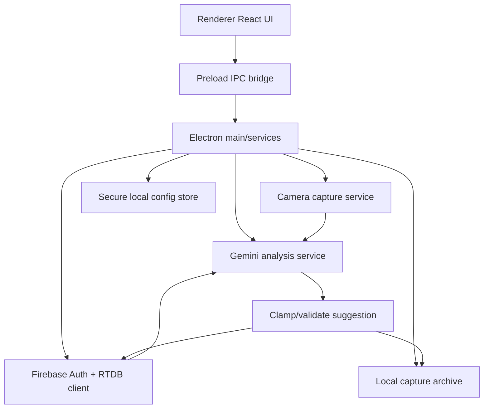
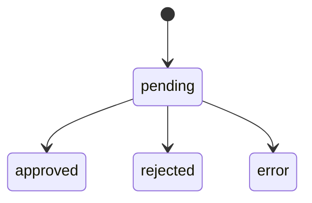

# Objective
Build two coordinated additions for the IFungi mushroom greenhouse project without touching firmware:

1. A new standalone Electron desktop app in `ifungi-ai-desktop/` that captures webcam images, reads RTDB state, calls Gemini 2.0 Flash with vision, validates structured recommendations, and writes pending AI suggestions to Realtime Database while keeping full images local.
2. A new `AISuggestionsPanel` flow in the existing web app that lets operators review, approve, reject, and browse recent AI suggestions.

## Confirmed Decisions
- **Web navigation shape**: choose the **lowest-refactor protected route structure** that fits the current app, meaning a **new protected sibling route/tab** rather than a large nested dashboard shell refactor.
- **Desktop scheduling**: use the **simplest reliable app-managed daily timer** persisted locally, with catch-up logic on app launch, instead of `node-cron` tied to continuous process uptime.
- **Secret storage**: use **Electron `safeStorage` when available**, with a local persisted encrypted/plain fallback only when `safeStorage` is unavailable.
- **Reject reason UX**: rejection reason is **optional**, but the UI should **prompt for it** before confirming rejection.

## Current Codebase Integration Points
- Routing is centralized in `src/app/AppRouter.jsx`.
- The existing app uses React + Vite + Firebase RTDB/Auth with a protected `/dashboard` route.
- Firebase initialization lives in `src/firebase.js`.
- Auth and RTDB access patterns are already encapsulated in `src/services/auth.js` and `src/services/rtdb.js`.
- The dashboard is currently a single-page screen, so adding the AI UI as a protected sibling route minimizes disruption.

---

# Part 1 — Electron Desktop App Plan

## Target Structure
Create a fully isolated project under:

- `ifungi-ai-desktop/package.json`
- `ifungi-ai-desktop/tsconfig.json`
- `ifungi-ai-desktop/vite.config.ts`
- `ifungi-ai-desktop/electron.vite.config.ts` or equivalent Vite/Electron build config
- `ifungi-ai-desktop/src/main/*`
- `ifungi-ai-desktop/src/preload/*`
- `ifungi-ai-desktop/src/renderer/*`
- `ifungi-ai-desktop/.env.example`
- `ifungi-ai-desktop/README.md`

Keep it independent from the root app:
- no root workspace conversion
- no changes to existing hosting/deploy flow
- no shared build assumptions with the web app

## Recommended Desktop Architecture



## Desktop Functional Modules

### 1. Electron shell and project scaffolding
Create:
- `src/main/main.ts` for BrowserWindow lifecycle
- `src/preload/index.ts` for a typed IPC API
- `src/renderer/main.tsx` and `src/renderer/App.tsx`

Use page-level renderer routes/views for:
- `SetupPage`
- `CapturePage`
- `HistoryPage`

### 2. Local persisted configuration
Create a configuration layer to store:
- Gemini API key
- Firebase email
- Firebase password
- greenhouse ID
- selected webcam device IDs (1–2 cameras)
- daily capture time
- last successful scheduled run metadata

Recommended files:
- `src/main/services/configStore.ts`
- `src/main/services/secureStorage.ts`
- `src/shared/types.ts`

Behavior:
- prefer `safeStorage` for sensitive values
- store non-sensitive settings in a local JSON config file under app data
- expose redacted read access to renderer
- never send full local image archives to Firebase

### 3. Camera discovery and capture
Renderer responsibilities:
- enumerate video input devices with `navigator.mediaDevices.enumerateDevices()`
- show live preview in `CapturePage`
- allow selecting one or two webcams in `SetupPage`
- allow manual capture and optional text note in `CapturePage`

Capture pipeline:
- use `getUserMedia` in renderer for preview/capture
- convert frames to JPEG blobs/base64 thumbnails
- pass capture payload to main process for persistence and analysis

Recommended files:
- `src/renderer/features/capture/useCameraDevices.ts`
- `src/renderer/features/capture/CapturePreview.tsx`
- `src/main/services/captureArchive.ts`

### 4. Firebase integration for desktop
Desktop app should initialize its own Firebase client with the same public web config pattern.

Recommended files:
- `src/main/services/firebaseClient.ts`
- `src/main/services/authSession.ts`
- `src/main/services/aiSuggestionsRepository.ts`

Responsibilities:
- sign in with Firebase email/password
- read:
  - `/greenhouses/{id}/sensores`
  - `/greenhouses/{id}/setpoints`
  - `/greenhouses/{id}/operation_mode`
- write:
  - `/greenhouses/{id}/ai_suggestions/{timestamp}`
- subscribe for history list rendering if needed

### 5. Gemini vision analysis service
Create a dedicated service:
- `src/main/services/geminiAnalyzer.ts`
- `src/main/prompts/mushroomExpertPrompt.ts`

Responsibilities:
- build structured prompt using:
  - 1–2 captured images
  - operator text note if provided
  - live greenhouse RTDB state
- call Gemini 2.0 Flash via `@google/generative-ai`
- require JSON-only output matching:
  - `rationale`
  - `observations`
  - `suggested_setpoints`
  - `suggested_mode`
  - `confidence`
  - `risk_flags`

Prompt design should explicitly instruct the model to:
- act as a mushroom cultivation expert
- reason over environmental readings and visual crop conditions
- avoid unsafe or implausible values
- return machine-parseable JSON only

### 6. Validation and normalization layer
Create:
- `src/main/services/suggestionValidator.ts`

Clamp rules:
- `tMin`, `tMax`: 0–60
- `uMin`, `uMax`: 0–100
- `coSp`: 0–1000
- `co2Sp`: 0–5000
- `tvocsSp`: 0–2000
- `lux`: 0–50000
- `confidence`: 0–1

Validation responsibilities:
- coerce numeric values
- reject malformed response payloads
- normalize timestamps and status fields
- preserve raw response separately for debugging only if local-only
- prevent invalid writes to RTDB

### 7. Suggestion persistence model
Recommended RTDB record shape:

```json
{
  "createdAt": 1710000000000,
  "status": "pending",
  "source": "desktop-ai",
  "greenhouseId": "abc",
  "rationale": "...",
  "observations": ["..."],
  "suggested_setpoints": {
    "tMin": 20,
    "tMax": 24,
    "uMin": 85,
    "uMax": 93,
    "coSp": 100,
    "co2Sp": 900,
    "tvocsSp": 250,
    "lux": 1200
  },
  "suggested_mode": "automatic",
  "confidence": 0.84,
  "risk_flags": ["possible_bacterial_blotch"],
  "thumbnails": {
    "cam1": "data:image/jpeg;base64,...",
    "cam2": "data:image/jpeg;base64,..."
  },
  "captureMeta": {
    "note": "optional description",
    "localPaths": ["~/IFungi/captures/...jpg"]
  }
}
```

Notes:
- full-resolution photos remain local under `~/IFungi/captures/`
- only thumbnails/base64 previews go to RTDB
- use explicit status transitions: `pending`, `approved`, `rejected`, `error`

### 8. Scheduler design
Implement a lightweight scheduler service:
- `src/main/services/scheduler.ts`

Recommended behavior:
- persist desired daily capture time
- on app startup, compute whether today’s scheduled capture is still due
- maintain `lastRunAt` and `lastSuccessfulRunAt`
- trigger one automated analysis per due day while app is running
- allow manual run anytime from `CapturePage`

Why this approach:
- simpler and more reliable than `node-cron` for a desktop app that may not stay open continuously
- easier to reason about across sleep/wake/relaunch scenarios

### 9. Desktop UI plan

#### Setup page
Fields:
- Gemini API key
- Firebase email/password
- greenhouse ID
- webcam 1 selector
- webcam 2 selector (optional)
- daily capture time
- save/test connection actions

#### Capture page
Elements:
- live preview cards for selected webcams
- optional note/description input
- `Capture Now` button
- current greenhouse summary snapshot
- latest analysis run status

#### History page
Elements:
- recent suggestion list
- thumbnails
- suggestion status badge
- rationale/observations preview
- confidence display
- created time
- detail drawer or modal for full payload

### 10. Desktop validation and quality gates
Planned checks:
- TypeScript compile succeeds in `ifungi-ai-desktop/`
- Electron renderer build succeeds
- camera selection and preview work with 1 and 2 device configurations
- malformed Gemini JSON is handled gracefully
- RTDB write payload is clamped and status is `pending`
- local capture archive path creation and metadata persistence work

---

# Part 2 — Web AI Suggestions Panel Plan

## Recommended Route Strategy
Use a **new protected sibling route** to minimize refactoring:
- keep `/dashboard` as the current main operational page
- add `/ai-suggestions` as a new protected page
- add a lightweight shared top navigation/header component used by both routes

This avoids turning the entire current dashboard into a nested layout tree.

## Web Architecture

```mermaid
flowchart LR
    RTDB[Realtime Database ai_suggestions] --> HOOK[useAISuggestions hook]
    HOOK --> PAGE[AISuggestionsPage]
    PAGE --> PANEL[Latest pending panel]
    PAGE --> HISTORY[History list/tab]
    PANEL --> APPROVE[Approve action]
    PANEL --> REJECT[Reject action]
    APPROVE --> RTDB
    REJECT --> RTDB
    APPROVE --> SETPOINTS[/greenhouses/{id}/setpoints]
```

## Web Files to Add or Update

### Route and navigation
Update:
- `src/app/AppRouter.jsx`

Add:
- `src/components/AppHeader.jsx` or equivalent shared header component
- `src/components/AppNavTabs.jsx`
- `src/pages/AISuggestionsPage.jsx`

Purpose:
- preserve existing branding/logout behavior
- add a visible navigation entry to switch between `Dashboard` and `AI Suggestions`

### AI suggestion data layer
Add:
- `src/services/aiSuggestions.js`
- `src/hooks/useAISuggestions.js`

Responsibilities:
- subscribe to `/greenhouses/{id}/ai_suggestions`
- sort by `createdAt` descending client-side if query ordering support is limited in existing abstraction
- split latest pending suggestion from historical items
- cap history display to last 30 entries

Suggested API surface:
- subscribe suggestions by greenhouse ID
- approve suggestion
- reject suggestion
- format comparison metadata

### UI components
Add:
- `src/components/ai/AISuggestionsPanel.jsx`
- `src/components/ai/SuggestionDiffTable.jsx`
- `src/components/ai/SuggestionHistoryList.jsx`
- `src/components/ai/RejectSuggestionDialog.jsx`
- optional `src/components/ai/StatusBadge.jsx`

## Web UI behavior

### Latest pending suggestion view
Show:
- primary thumbnail
- rationale
- observations list if present
- confidence score
- risk flags
- current vs suggested setpoints comparison
- suggested mode

Diff rows should include:
- field label
- current value
- arrow indicator
- suggested value
- highlight changed values only, or show all with changed emphasis

Tracked fields:
- `tMin`
- `tMax`
- `uMin`
- `uMax`
- `coSp`
- `co2Sp`
- `tvocsSp`
- `lux`
- `operation_mode` vs `suggested_mode`

### Approve flow
Approve action should:
1. write `suggested_setpoints` to `/greenhouses/{id}/setpoints`
2. optionally write `suggested_mode` to `/greenhouses/{id}/operation_mode` if provided and valid
3. update suggestion record status to `approved`
4. add approval metadata such as:
   - `reviewedAt`
   - `reviewAction: approved`
   - `reviewedBy` if current user identity is available

### Reject flow
Reject action should:
1. open prompt/dialog for optional reason
2. mark suggestion `rejected`
3. store:
   - `reviewedAt`
   - `reviewAction: rejected`
   - `rejectReason` when provided
   - `reviewedBy` if available

### History tab/list
Show last 30 suggestions with:
- thumbnail
- created date/time
- status
- confidence
- summary rationale excerpt
- risk flags preview
- click-to-expand detail view

## Styling approach
Follow existing visual conventions:
- reuse motion/card styling patterns from the dashboard where practical
- use the same icon set already present in the project
- keep styling in the existing CSS system rather than introducing a new styling framework

## Web validation and quality gates
Planned checks:
- route registration works for authenticated users
- existing `/dashboard` remains unchanged functionally
- suggestion subscription handles empty state and pending-only state
- approve action updates setpoints and suggestion status atomically as closely as RTDB patterns allow
- reject flow works with and without a reason
- history list shows max 30 items
- visual diff correctly compares current vs suggested values

---

# Data and Contract Decisions

## Shared suggestion contract
Use one normalized payload format across desktop write path and web read path.

Required fields:
- `createdAt`
- `status`
- `rationale`
- `suggested_setpoints`
- `confidence`
- `risk_flags`

Recommended optional fields:
- `observations`
- `suggested_mode`
- `thumbnails`
- `captureMeta.note`
- `reviewedAt`
- `reviewAction`
- `reviewedBy`
- `rejectReason`

## Status lifecycle


## Error-handling requirements
- desktop app must surface auth, RTDB read, Gemini parse, and write failures clearly in the UI
- invalid AI responses must never propagate directly to RTDB without validation
- web panel must tolerate missing thumbnails, missing observations, and legacy suggestion records

---

# Sequenced Implementation Plan

## Step 1 — Establish data contracts and desktop/app boundaries
**Targets**
- `ifungi-ai-desktop/` structure
- shared suggestion schema definition within desktop app
- web-side expected RTDB shape documented in implementation

**Outputs**
- desktop project skeleton
- normalized interfaces/types for AI suggestion records
- storage and scheduler decisions encoded in architecture

**Verification**
- desktop and web both reference the same field names and statuses

## Step 2 — Build desktop infrastructure and secure settings flow
**Targets**
- Electron shell
- preload bridge
- config store
- safe secret storage fallback
- Firebase auth/session bootstrap

**Outputs**
- Setup page functional for save/load/test configuration
- secure local persistence in place

**Verification**
- saved config reloads correctly and sensitive values are not exposed unnecessarily

## Step 3 — Implement capture, analysis, validation, and RTDB write pipeline
**Targets**
- webcam device discovery
- manual capture flow
- Gemini analysis service
- response validator/clamp layer
- AI suggestion repository write path

**Outputs**
- manual `Capture Now` creates local files and pending suggestion entries

**Verification**
- written payload conforms to schema and clamp constraints

## Step 4 — Add desktop history and scheduler behavior
**Targets**
- History page
- local/remote history display
- due-on-launch daily scheduler logic
- run state feedback

**Outputs**
- operator can review past analyses from desktop
- scheduled run behavior is deterministic across relaunches

**Verification**
- one due run per day max, manual runs unaffected

## Step 5 — Add web route, header/nav reuse, and AI data hooks
**Targets**
- `src/app/AppRouter.jsx`
- shared app header/nav components
- AI suggestions service/hook
- new page shell

**Outputs**
- authenticated navigation between dashboard and AI suggestions
- live RTDB subscription for suggestion data

**Verification**
- dashboard still renders normally and AI route loads without breaking auth flow

## Step 6 — Implement review panel, diff UI, approve/reject actions, and history tab
**Targets**
- `AISuggestionsPanel`
- diff renderer
- rejection prompt
- history list
- RTDB mutation paths for approve/reject

**Outputs**
- operators can review latest pending suggestion and browse last 30 suggestions

**Verification**
- approve writes setpoints/status correctly; reject stores optional reason

## Step 7 — Final hardening and documentation
**Targets**
- root and desktop README/doc updates as needed
- edge-state handling
- targeted build/type validation

**Outputs**
- clear setup instructions for local AI desktop usage
- implementation ready for review/testing

**Verification**
- web build and desktop build pass with documented setup steps

---

# Constraints and Non-Goals
- Do **not** modify firmware.
- Do **not** convert the root project into a workspace/monorepo manager unless explicitly requested.
- Do **not** move full-resolution images to Firebase.
- Do **not** add unrelated backend infrastructure beyond what is required in the desktop app.
- Do **not** perform a broad dashboard redesign; keep the web integration minimal and consistent.

---

# Definition of Done
- A standalone `ifungi-ai-desktop/` app exists with Setup, Capture, and History pages.
- The desktop app can save secure config, capture from 1–2 webcams, read greenhouse RTDB data, call Gemini, validate the response, and write a `pending` suggestion entry.
- Full photos are stored locally; only thumbnails are written remotely.
- The web app has a new protected AI suggestions route/tab.
- The web panel shows the latest pending suggestion, confidence, risk flags, rationale, and a current-vs-suggested diff.
- Approve updates greenhouse setpoints and marks the suggestion approved.
- Reject marks the suggestion rejected and optionally stores a reason.
- History shows the latest 30 suggestions.
- Existing dashboard behavior remains intact.

---

# Step → Targets → Verification Traceability
| Step | Targets | Verification |
|---|---|---|
| 1 | Desktop skeleton, schema, boundaries | Same contract usable by desktop write and web read paths |
| 2 | Secure config + Firebase session | Config reloads and sensitive handling are correct |
| 3 | Capture + Gemini + validation + RTDB write | Pending suggestions are valid and clamped |
| 4 | Desktop history + scheduler | Daily run logic is deterministic and visible |
| 5 | Web route + nav + subscription | Protected navigation works and dashboard remains stable |
| 6 | Panel + diff + approve/reject + history | Review actions mutate RTDB as intended |
| 7 | Docs + hardening + validation | Build/type checks and setup instructions are complete |